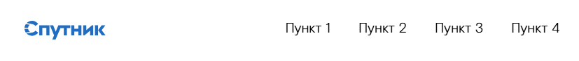
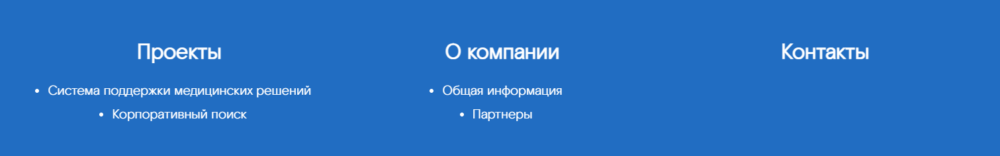

# sputnik-ui
## Описание 
Библиотека sputnik-ui - это набор готовых к использованию компонентов, собранных в одном месте, для упрощения и ускорения процесса создания лендингов, сайтов-визиток и других веб-страниц.  
Входные данные всех компонентов заполнены по умолчанию.

## Установка библиотеки
npm install --save git+http://gitlab-s1.ix.km/sputnik/sputnik-ui.git

### Компоненты
### Page - Страница
Является компонентом-оберткой для остальных компонентов.

#### Пример использования
```
<Page>
  <Menu />
  <Cover />
  <Divider />
  <HorizontalCardsBlock />
  <VerticalCardWithImageAndText theme="dark" />
  <NumberedList />
  <TextBlockWithHeader theme="dark" />
  <MultiColumnListWithIcons />
  <Stages theme="dark" />
  <GridWithCards />
  <Contacts />
  <Footer />
</Page>
```


### Menu - Меню
Компонент, отображающий меню.  

#### Входные данные
* `items` - массив пунктов меню
  * `text` - текст пункта меню
  * `onClick` - функция, вызываемая при клике на пункт
  * `submenu` - (опционально) массив подменю, где каждый элемент имеет ту же структуру, что и `items`
* `logoIconPath` - путь к иконке логотипа
* `onClickLogo` - функция, вызываемая при клике на логотип

#### Пример использования
```
<template>
  <Page>
    <Menu
      :items="menuItems"
      :logoIconPath="require('@/assets/icons/logo.svg')"
      :onClickLogo="onClickLogo"
    />
  </Page>
</template>

<script>
  import { Menu, Page } from 'sputnik-ui/src/index';
  export default {
    components: { Menu, Page },
    data() {
      return {
        menuItems: [
          { text: 'Пункт 1', submenu: [
            { text: 'Подпункт', onClick: () => window.location.href = '/punkt1/sub1' },
            { text: 'Подпункт', onClick: () => window.location.href = '/punkt1/sub2' },
            { text: 'Подпункт', onClick: () => window.location.href = '/punkt1/sub3' },
            { text: 'Подпункт', onClick: () => window.location.href = '/punkt1/sub4' },
          ] },
          { text: 'Пункт 2', submenu: [
            { text: 'Подпункт', onClick: () => window.location.href = '/punkt2/sub1' },
            { text: 'Подпункт', onClick: () => window.location.href = '/punkt2/sub2' }
          ] },
          { text: 'Пункт 3', onClick: () => window.location.href = '/punkt3' },
          { text: 'Пункт 4', onClick: () => window.location.href = '/punkt4' }
        ]
      };
    },
    methods: {
      onClickLogo() {
        window.location.href = '/';
      }
    }
  }
</script>
```


### CoverWithText - Обложка
Компонент, отображающий картинку на заднем плане и заголовок с текстом на переднем плане.


#### Входные данные

* `backgroundImagePath` - путь к картинке на заднем плане
* `header` - заголовок
* `text` - текст

#### Пример использования
`<Cover :backgroundImagePath="require('@/assets/imgs/cover.png')" header="Заголовок" text="Текст" />`


### HorizontalCardWithImageAndText - Горизонтальная карточка с картинкой и текстом
Компонент, отображающий карточку с заголовком, текстом и изображением, которое может быть расположено слева или справа.


#### Входные данные

* `item` - объект, содержащий данные для отображения:
  * `imagePath` - путь к изображению
  * `header` - заголовок
  * `text` - текст
  * `imagePosition` - позиция изображения ('left' или 'right')
  * `onClick` - функция, вызываемая при клике на карточку

#### Пример использования

```
<template>
  <Page>
    <HorizontalCardWithImageAndText :item="{
      imagePath: require('@/assets/imgs/project.png'),
      header: 'Проект',
      text: 'Это наш проект. Это наш проект. Это наш проект. Это наш проект.',
      imagePosition: 'right',
      onClick: handleCardClick
    }" />
  </Page>
</template>

<script>
  import { HorizontalCardWithImageAndText, Page } from 'sputnik-ui/src/index';
  export default {
    components: { HorizontalCardWithImageAndText, Page },
    methods: {
        handleCardClick() {
            // обработка клика по карточке
        }
    }
  }
</script>
```


### HorizontalCardsBlock - Блок с горизонтальными карточками
Компонент, отображающий несколько `HorizontalCardWithImageAndText` в виде блока.


#### Входные данные

* `items` - массив объектов, содержащих данные для отображения:
  * `imagePath` - путь к изображению
  * `header` - заголовок
  * `text` - текст
  * `imagePosition` - позиция изображения ('left' или 'right')
  * `onClick` - функция, вызываемая при клике на карточку

#### Пример использования
```
<template>
  <Page>
    <HorizontalCardsBlock :items="horizontalCardsBlockItems" />
  </Page>
</template>

<script>
  import {HorizontalCardsBlock, Page} from 'sputnik-ui/src/index';
  export default {
    components: { HorizontalCardsBlock, Page },
    data() {
      return {
        horizontalCardsBlockItems: [
          {
            header: 'Бизнес-инкубатор',
            text: 'Это структурное подразделение, которое оказывает содействие в развитии инновационных проектов, начиная от стадии идеи и заканчивая реализацией готового продукта.',
            imagePosition: 'left',
            imagePath: require('@/assets/imgs/project.png'),
            onClick: () => {}
          },
          {
            header: 'Бизнес-акселератор',
            text: 'Это программа, которая помогает инновационным проектам достичь своих целей за счет привлечения ресурсов и знаний извне.',
            imagePosition: 'right',
            imagePath: require('@/assets/imgs/project2.png'),
            onClick: () => {}
          }
        ],
      };
  },
}
</script>
```

### VerticalCardWithImageAndText - Вертикальная карточка с картинкой и текстом
Компонент, отображающий карточку с заголовком, текстом и изображением, расположенным сверху.


#### Входные данные

* `imagePath` - путь к изображению
* `header` - заголовок
* `text` - текст

#### Пример использования

```
<VerticalCardWithImageAndText
  :imagePath="require('../assets/imgs/search.png')"
  header="Корпоративный поиск" 
  text="Поиск — это один из ключевых механизмов доступа пользователей к нужной им информации. Но нередко поиск информации занимает слишком много времени. Основными проблемами во многих организациях являются большая трата времени на поиск необходимого документа и дублирование работы"
/>
```


### Stages - Этапы  
Компонент, отображающий последовательность этапов с заголовками и текстом. Может использоваться для описания процесса, проекта или любой другой информации, которая должна быть представлена в виде шагов.


#### Входные данные
* `items` - массив этапов:
  * `title` - заголовок
  * `text` - текст
* `theme` - тема (light или dark)
* `title` - заголовок всего блока

#### Пример использования
```
<template>
  <Page>
    <Stages 
      theme="dark"
      title="Установка"
      :items="stages"
    />
  </Page>
</template>

<script>
import { Stages, Page } from 'sputnik-ui/src/index';
export default {
  components: {Stages, Page},
  data() {
    return {
        stages: [  
            { title: 'Установка Docker', text: 'Необходимо установить Docker на компьютере или сервере, где планируется разворачивать поиск. Если Docker отсутствует, загрузите его с официального сайта.' },  
            { title: 'Загрузка дистрибутива', text: 'Скачайте дистрибутив с официального сайта, введя логин и пароль, затем сохраните файл на своем устройстве.' },  
            { title: 'Загрузка образа корпоративного поиска', text: 'Запустите Docker и введите команду для загрузки образа в командной строке: docker load -i c:/install/searchbox.gz.' },  
            { title: 'Создание и запуск контейнера', text: 'В командной строке Docker введите команду для создания и запуска контейнера: docker run —name searchbox -d -h searchbox.sputnik.ru -p 80:9013 searchbox:x.x.xx, заменив x.x.xx на актуальную версию.' },  
            { title: 'Проверка установки', text: 'Откройте браузер и введите адрес http://localhost для доступа к интерфейсу администрирования корпоративного поиска.' }  
        ],  
    };
  },
};
</script>
```

### TextBlockWithHeader - Текстовый блок с заголовком

Компонент, отображающий текстовый блок с заголовком. Позволяет указать тему оформления и содержимое текста в формате HTML.


#### Входные данные

* `title` - заголовок блока
* `text` - содержимое текста, поддерживает HTML-разметку
* `theme` - тема оформления блока ('light' или 'dark')

#### Пример использования

```
<template>
  <Page>
    <TextBlockWithHeader 
      title="Поисковый портал «Спутник»" 
      text="Мы разрабатываем инновационные решения для государственных органов и крупных компаний, что дает возможность эффективно решать задачи импортозамещения и оптимизации бизнес-процессов. <br /> Мы гордимся сотрудничеством с такими уважаемыми клиентами, как Почта России и ГИБДД РФ, что подтверждает высокое качество наших решений и доверие к нашей компании. <br /> Присоединяйтесь к «Спутнику» и откройте новые возможности для роста и развития вашего бизнеса с надежным партнером в мире технологий!" 
      theme="dark" 
    />
  </Page>
</template>

<script>
import { TextBlockWithHeader, Page } from 'sputnik-ui/src/index';

export default {
  components: { TextBlockWithHeader, Page }
}
</script>
```


### NumberedList - Нумерованный список в одну колонку

Компонент, отображающий список с нумерованными пунктами. Каждый пункт списка состоит из заголовка (`title`) и текста (`text`).


#### Входные данные

* `items` - массив объектов, содержащих данные для отображения:
  * `title` - заголовок пункта
  * `text` - текст пункта

#### Пример использования
```
<template>
	<Page>
		<NumberedList :items="numberedListItems" />
	</Page>
</template>

<script>
import { NumberedList, Page } from 'sputnik-ui/src/index';

export default {,
  components: {NumberedList, Page},
  data() {
    return {
      numberedListItems: [  
        {  
          "title": "Надежные решения",  
          "text": "Компания разрабатывает программное обеспечение, которое успешно используется в крупных государственных органах и компаниях, таких как Почта России и ГИБДД РФ."  
        },  
        {  
          "title": "Инновационные технологии",  
          "text": "Продукты компании включают аналитическую систему и корпоративный поиск с использованием машинного обучения, что позволяет эффективно обрабатывать и анализировать данные."  
        },  
        {  
          "title": "Поддержка импортозамещения",  
          "text": "Компания предлагает решения, способствующие импортозамещению и расширению возможностей для российских пользователей и организаций."  
        }  
      ]  
    }
  }
};
</script>
```

### MultiColumnListWithIcons - Список в несколько колонок с иконками

Компонент, отображающий список элементов с заголовками и текстом, где каждый элемент имеет иконку. Поддерживает отображение в нескольких колонках.


#### Входные данные

* `header` - заголовок блока
* `text` - описание блока
* `items` - массив объектов, содержащих данные для отображения:
  * `icon` - путь к иконке
  * `header` - заголовок элемента
  * `text` - текст элемента
* `theme` - тема оформления блока ('light' или 'dark')

#### Пример использования

```
<template>
  <Page>
    <MultiColumnListWithIcons
      header="Преимущества"
      text="Это наши преимущества"
      :items="advantages"
      theme="dark"
    />
  </Page>
</template>

<script>
import { MultiColumnListWithIcons, Page } from 'sputnik-ui/src/index';

export default {
  components: { Page, MultiColumnListWithIcons },
  data() {
    return {
      advantages: [
        {
          icon: require('@/assets/icons/star.svg'),
          header: 'Сокращение ошибок',
          text: 'Система помогает врачам предотвращать ошибки в решениях и улучшает безопасность.'
        },
        {
          icon: require('@/assets/icons/star.svg'),
          header: 'Качество',
          text: 'Передовые технологии улучшают диагностику и выбор лечения.'
        },
        {
          icon: require('@/assets/icons/star.svg'),
          header: 'Доступность',
          text: 'Предоставляет высококвалифицированные услуги даже в удалённых регионах.'
        }
      ]
    };
  }
};
</script>
```

### GridWithCards - Сетка с карточками
Компонент, отображающий несколько карточек в виде сетки.


#### Входные данные

* `title` - заголовок блока
* `theme` - тема оформления блока ('light' или 'dark')
* `items` - массив объектов, содержащих данные для отображения:
  * `imagePath` - путь к изображению
  * `title` - заголовок
  * `text` - текст
  * `link` - ссылка
  * `linkName` - текст ссылки

#### Пример использования
```
<template>
	<Page>
		<GridWithCards :items="items" />
	</Page>
</template>

<script>
import { GridWithCards, Page } from 'sputnik-ui/src/index';

export default {
  components: { GridWithCards, Page },
  data() {
    return {
      items: [  
        {  
          "imagePath": require('../assets/imgs/astralinux.png'),  
          "title": "Astra Linux",  
          "text": "Один из лидеров российского рынка информационных технологий в области разработки программного обеспечения.",  
          "link": "https://astralinux.ru/",  
          "linkName": "Перейти на сайт компании"  
        },  
        {  
          "imagePath": require('../assets/imgs/alt_base.png'),  
          "title": "Базальт СПО",  
          "text": "Российский разработчик программной платформы АЛЬТ.",  
          "link": "https://www.basealt.ru/",  
          "linkName": "Перейти на сайт компании"  
        },  
    ]  
    };
  },
};
</script>
```

### Contacts - Контакты

Компонент, отображающий контактную информацию: заголовок, подзаголовок, телефон, электронную почту и адрес.


#### Входные данные

* `title` - заголовок
* `subtitle` - подзаголовок
* `telephoneNumber` - номер телефона
* `email` - электронная почта
* `address` - адрес
* `theme` - тема (light или dark)

#### Пример использования
```
<ContactsCard   
  title="Связаться с нами"   
  subtitle="Компания 'Спутник'"   
  telephoneNumber="8 800 555-35-35"   
  email="support@corp.sputnik.ru"   
  address="123456, г. Москва, ул. Примерная, д. 1"   
  theme="dark"  
/>
```

### Footer - Подвал с расширенным меню
Компонент, отображающий подвал с пунктами и подпунктами меню.  

#### Входные данные
* `items` - массив пунктов меню
  * `text` - текст пункта меню
  * `onClick` - функция, вызываемая при клике на пункт
  * `submenu` - (опционально) массив подменю, где каждый элемент имеет ту же структуру, что и `items`

#### Пример использования
```
<template>
  <Page>
    <Footer :items="footerItems"/>
  </Page>
</template>

<script>
  import { Footer, Page } from 'sputnik-ui/src/index';
  export default {
    components: { Footer, Page },
    data() {
      return {
        footerItems: [
          { text: 'Пункт 1', submenu: [
            { text: 'Подпункт', onClick: () => window.location.href = '/punkt1/sub1' },
            { text: 'Подпункт', onClick: () => window.location.href = '/punkt1/sub2' },
            { text: 'Подпункт', onClick: () => window.location.href = '/punkt1/sub3' },
            { text: 'Подпункт', onClick: () => window.location.href = '/punkt1/sub4' },
          ] },
          { text: 'Пункт 2', submenu: [
            { text: 'Подпункт', onClick: () => window.location.href = '/punkt2/sub1' },
            { text: 'Подпункт', onClick: () => window.location.href = '/punkt2/sub2' }
          ] },
          { text: 'Пункт 3', onClick: () => window.location.href = '/punkt3' },
          { text: 'Пункт 4', onClick: () => window.location.href = '/punkt4' }
        ]
      };
    },
    methods: {
      onClickLogo() {
        window.location.href = '/';
      }
    }
  }
</script>
```