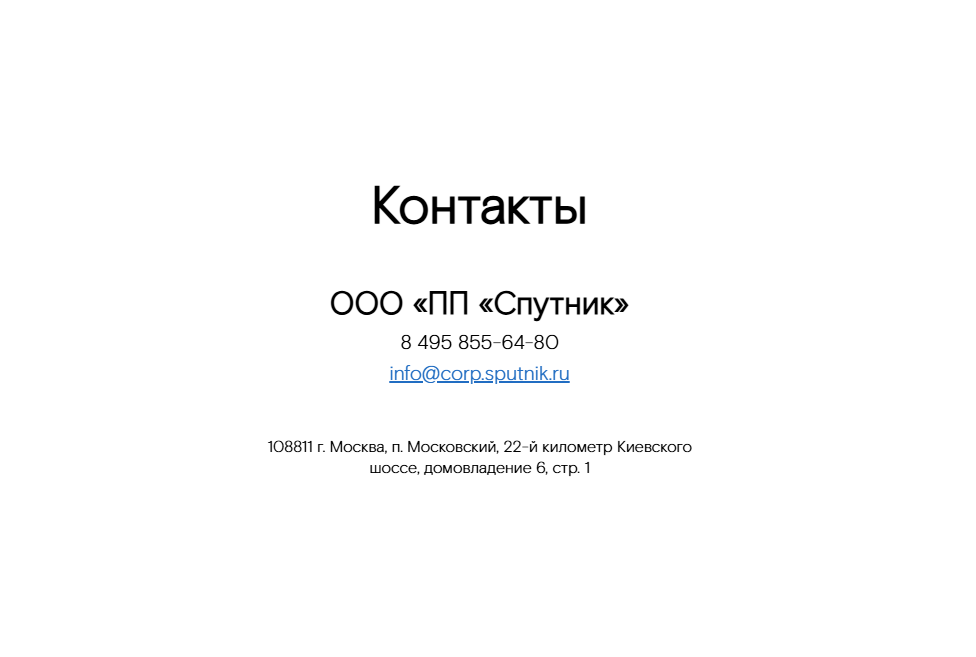

## Contacts - Контакты

Компонент, отображающий контактную информацию: заголовок, подзаголовок, телефон, электронную почту и адрес.


### Входные данные

* `title` - заголовок
* `subtitle` - подзаголовок
* `telephoneNumber` - номер телефона
* `email` - электронная почта
* `address` - адрес
* `theme` - тема (light или dark)

### Пример использования
```
<ContactsCard   
  title="Связаться с нами"   
  subtitle="Компания 'Спутник'"   
  telephoneNumber="8 800 555-35-35"   
  email="support@corp.sputnik.ru"   
  address="123456, г. Москва, ул. Примерная, д. 1"   
  theme="dark"  
/>
```