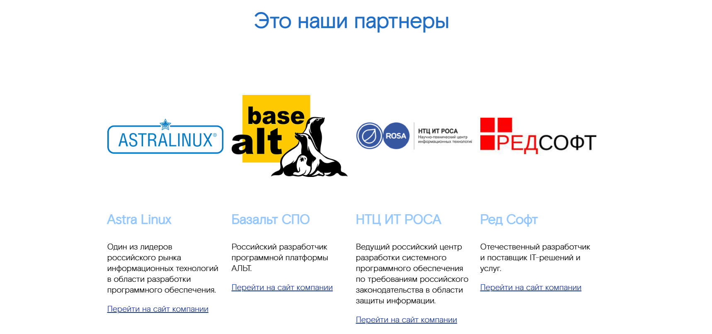

## GridWithCards - Сетка с карточками
Компонент, отображающий несколько карточек в виде сетки.

### Входные данные

* `title` - заголовок блока
* `theme` - тема оформления блока ('light' или 'dark')
* `items` - массив объектов, содержащих данные для отображения:
  * `imagePath` - путь к изображению
  * `title` - заголовок
  * `text` - текст
  * `link` - ссылка
  * `linkName` - текст ссылки

### Пример использования
```
<template>
    <Page>
        <GridWithCards :items="items" />
    </Page>
</template>

<script>
import { GridWithCards, Page } from 'sputnik-ui/src/index';

export default {
  components: { GridWithCards, Page },
  data() {
    return {
      items: [  
        {  
          "imagePath": require('../assets/imgs/astralinux.png'),  
          "title": "Astra Linux",  
          "text": "Один из лидеров российского рынка информационных технологий в области разработки программного обеспечения.",  
          "link": "https://astralinux.ru/",  
          "linkName": "Перейти на сайт компании"  
        },  
        {  
          "imagePath": require('../assets/imgs/alt_base.png'),  
          "title": "Базальт СПО",  
          "text": "Российский разработчик программной платформы АЛЬТ.",  
          "link": "https://www.basealt.ru/",  
          "linkName": "Перейти на сайт компании"  
        },  
    ]  
    };
  },
};
</script>
```