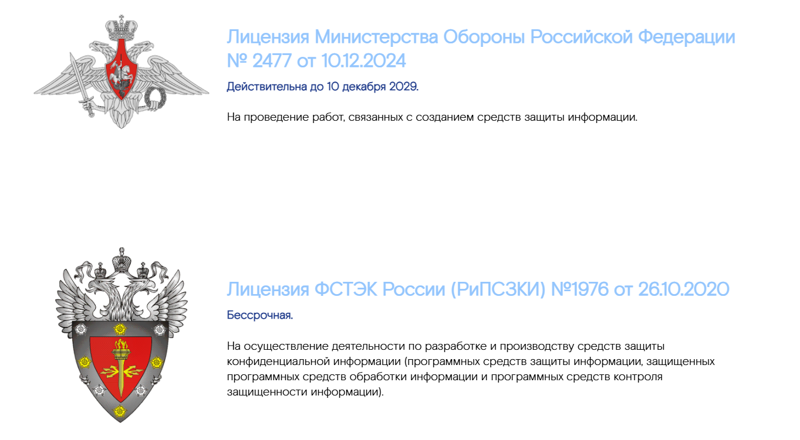

## HorizontalBlocksWithPictureTitleAndText - Список с горизонтальными блоками с картинкой, заголовком и текстом



### Входные данные
* `items` - массив объектов, содержащих данные для отображения:
  * `imagePath` - путь к изображению
  * `title` - заголовок
  * `subtitle` - подзаголовок
  * `text` - текст

### Пример использования
```
<template>
  <div>
    <HorizontalBlocksWithPictureTitleAndText 
    title="" 
    :items="items" 
    />
  </div>
</template>

<script>
import { HorizontalBlocksWithPictureTitleAndText } from 'sputnik-ui/src/index';

export default {
  name: 'LicensesPage',
  components: {
    HorizontalBlocksWithPictureTitleAndText
  },
  data() {
    return {
      items: [  
        {
          "imagePath": require('../assets/imgs/minobr.png'),  
          "title": "Лицензия Министерства Обороны Российской Федерации № 2477 от 10.12.2024",
          "subtitle": "Действительна до 10 декабря 2029.",
          "text": "На проведение работ, связанных с созданием средств защиты информации."
        },
        {
          "imagePath": require('../assets/imgs/FSTEC.png'),  
          "title": "Лицензия ФСТЭК России (РиПСЗКИ) №1976 от 26.10.2020",
          "subtitle": "Бессрочная.",
          "text": "На осуществление деятельности по разработке и производству средств защиты конфиденциальной информации (программных средств защиты информации, защищенных программных средств обработки информации и программных средств контроля защищенности информации).",
        },
        {
          "imagePath": require('../assets/imgs/FSTEC.png'),  
          "title": "Лицензия ФСТЭК России (ТЗКИ) №3826 от 26.10.2020",
          "subtitle": "Бессрочная.",
          "text": "На осуществление деятельности по технической защите конфиденциальной информации в части: контроля защищенности конфиденциальной информации от несанкционированного доступа, проектирования информационных систем в защищенном исполнении, а также установки, монтажа, испытаний и ремонта средств защиты информации и защищенных программных (программно-технических) средств обработки информации."
        },
        {
          "imagePath": require('../assets/imgs/fsb.png'),  
          "title": "Лицензия ФСБ России (ГТ) №36369",
          "subtitle": "Действительна до 03 августа 2026г.",
          "text": "На проведение работ, связанных с использованием сведений, составляющих государственную тайну."
        },
      ]
    }
  },
};
</script>
```