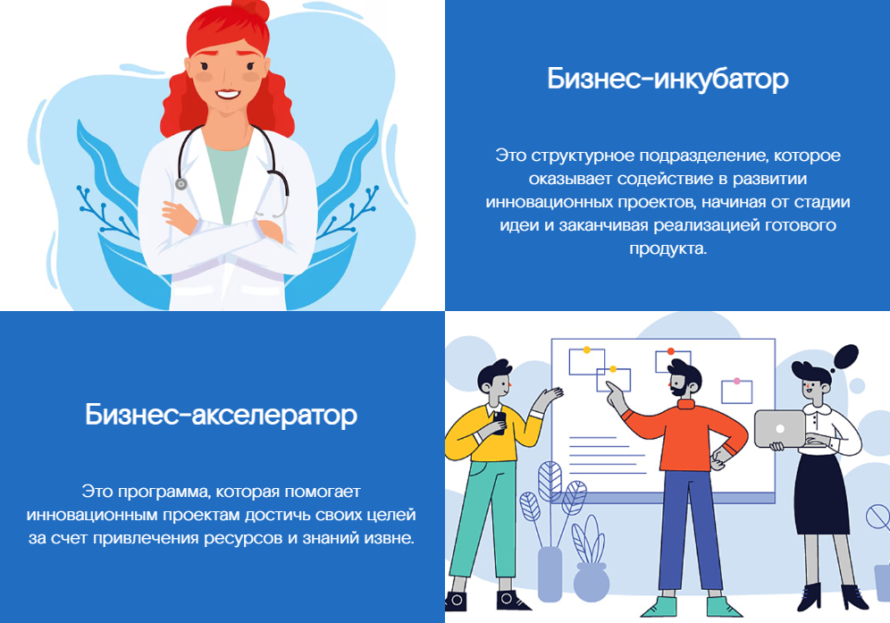

## HorizontalCardsBlock - Блок с горизонтальными карточками
Компонент, отображающий несколько `HorizontalCardWithImageAndText` в виде блока.


### Входные данные

* `items` - массив объектов, содержащих данные для отображения:
  * `imagePath` - путь к изображению
  * `header` - заголовок
  * `text` - текст
  * `imagePosition` - позиция изображения ('left' или 'right')
  * `onClick` - функция, вызываемая при клике на карточку

### Пример использования
```
<template>
  <Page>
    <HorizontalCardsBlock :items="horizontalCardsBlockItems" />
  </Page>
</template>

<script>
  import {HorizontalCardsBlock, Page} from 'sputnik-ui/src/index';
  export default {
    components: { HorizontalCardsBlock, Page },
    data() {
      return {
        horizontalCardsBlockItems: [
          {
            header: 'Бизнес-инкубатор',
            text: 'Это структурное подразделение, которое оказывает содействие в развитии инновационных проектов, начиная от стадии идеи и заканчивая реализацией готового продукта.',
            imagePosition: 'left',
            imagePath: require('@/assets/imgs/project.png'),
            onClick: () => {}
          },
          {
            header: 'Бизнес-акселератор',
            text: 'Это программа, которая помогает инновационным проектам достичь своих целей за счет привлечения ресурсов и знаний извне.',
            imagePosition: 'right',
            imagePath: require('@/assets/imgs/project2.png'),
            onClick: () => {}
          }
        ],
      };
  },
}
</script>
```