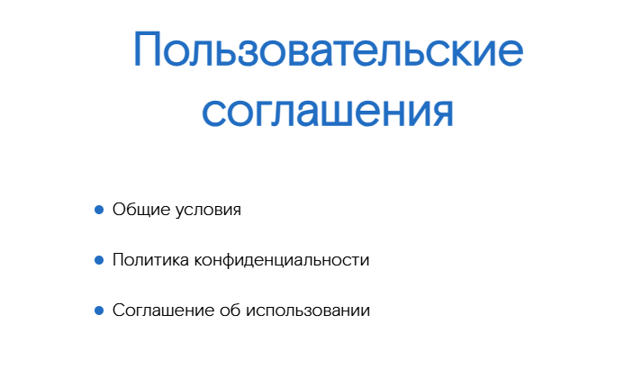

## List -  Список с заголовком



### Входные данные
* `items` - массив элементов списка:
  * `text` - текст элемента
  * `onClick` - функция, вызываемая при клике на элемент (необязательно)
* `title` - заголовок списка
* `theme` - тема (light или dark)


### Пример использования
```
<template>
    <List :items="items" title="Пользовательские соглашения" />
</template>

<script>
    import { List } from 'sputnik-ui/src/index';

    export default {
        name: 'UserAgreementsPage',
        components: {List},
        data() {
            return {
                items: [
                    { text: 'Общие условия', onClick: () => window.open('/docs/Общие_условия.pdf', '_blank')},
                    { text: 'Политика конфиденциальности', onClick: () => window.open('/docs/Политика_конфиденциальности.pdf', '_blank') },
                    { text: 'Соглашение об использовании', onClick: () => window.open('/docs/Соглашение_об_использовании.pdf', '_blank') },
                ]
            }
        }
    }
</script>
```