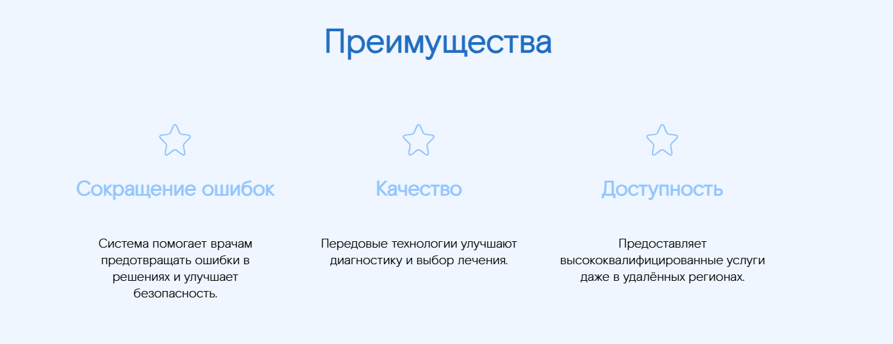

## MultiColumnListWithIcons - Список в несколько колонок с иконками

Компонент, отображающий список элементов с заголовками и текстом, где каждый элемент имеет иконку. Поддерживает отображение в нескольких колонках.



### Входные данные

* `header` - заголовок блока
* `text` - описание блока
* `items` - массив объектов, содержащих данные для отображения:
  * `icon` - путь к иконке
  * `header` - заголовок элемента
  * `text` - текст элемента
* `theme` - тема оформления блока ('light' или 'dark')

### Пример использования

```
<template>
  <Page>
    <MultiColumnListWithIcons
      header="Преимущества"
      text="Это наши преимущества"
      :items="advantages"
      theme="dark"
    />
  </Page>
</template>

<script>
import { MultiColumnListWithIcons, Page } from 'sputnik-ui/src/index';

export default {
  components: { Page, MultiColumnListWithIcons },
  data() {
    return {
      advantages: [
        {
          icon: require('@/assets/icons/star.svg'),
          header: 'Сокращение ошибок',
          text: 'Система помогает врачам предотвращать ошибки в решениях и улучшает безопасность.'
        },
        {
          icon: require('@/assets/icons/star.svg'),
          header: 'Качество',
          text: 'Передовые технологии улучшают диагностику и выбор лечения.'
        },
        {
          icon: require('@/assets/icons/star.svg'),
          header: 'Доступность',
          text: 'Предоставляет высококвалифицированные услуги даже в удалённых регионах.'
        }
      ]
    };
  }
};
</script>
```