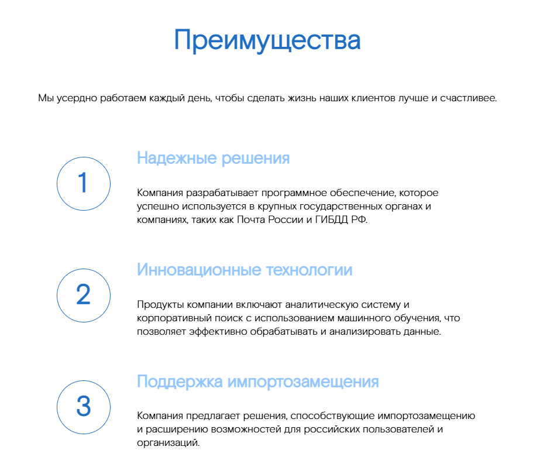

## NumberedList - Нумерованный список в одну колонку

Компонент, отображающий список с нумерованными пунктами. Каждый пункт списка состоит из заголовка (`title`) и текста (`text`).


### Входные данные

* `items` - массив объектов, содержащих данные для отображения:
  * `title` - заголовок пункта
  * `text` - текст пункта

### Пример использования
```
<template>
    <Page>
        <NumberedList :items="numberedListItems" />
    </Page>
</template>

<script>
import { NumberedList, Page } from 'sputnik-ui/src/index';

export default {,
  components: {NumberedList, Page},
  data() {
    return {
      numberedListItems: [  
        {  
          "title": "Надежные решения",  
          "text": "Компания разрабатывает программное обеспечение, которое успешно используется в крупных государственных органах и компаниях, таких как Почта России и ГИБДД РФ."  
        },  
        {  
          "title": "Инновационные технологии",  
          "text": "Продукты компании включают аналитическую систему и корпоративный поиск с использованием машинного обучения, что позволяет эффективно обрабатывать и анализировать данные."  
        },  
        {  
          "title": "Поддержка импортозамещения",  
          "text": "Компания предлагает решения, способствующие импортозамещению и расширению возможностей для российских пользователей и организаций."  
        }  
      ]  
    }
  }
};
</script>
```