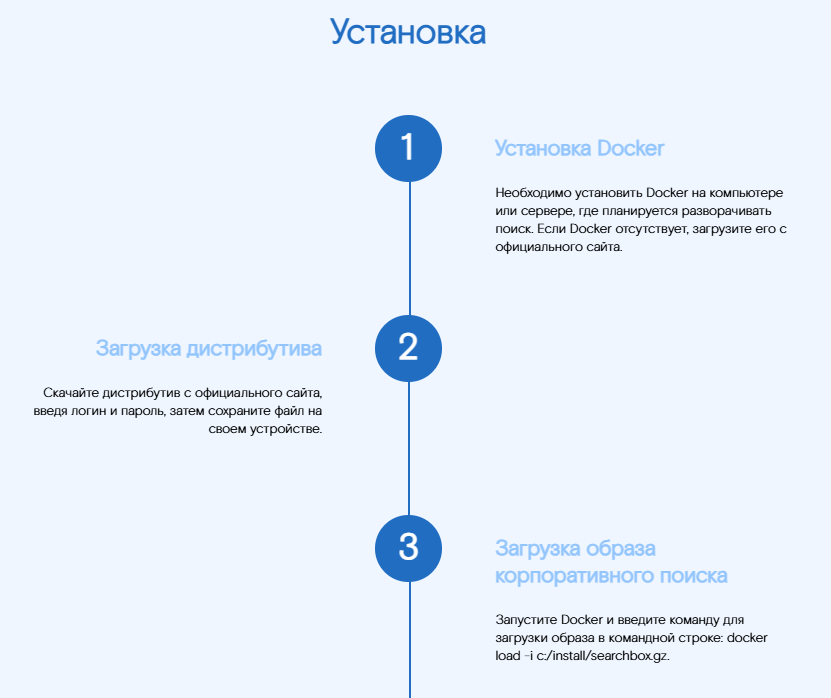

## Stages - Этапы  
Компонент, отображающий последовательность этапов с заголовками и текстом. Может использоваться для описания процесса, проекта или любой другой информации, которая должна быть представлена в виде шагов.


### Входные данные
* `items` - массив этапов:
  * `title` - заголовок
  * `text` - текст
* `theme` - тема (light или dark)
* `title` - заголовок всего блока

### Пример использования
```
<template>
  <Page>
    <Stages 
      theme="dark"
      title="Установка"
      :items="stages"
    />
  </Page>
</template>

<script>
import { Stages, Page } from 'sputnik-ui/src/index';
export default {
  components: {Stages, Page},
  data() {
    return {
        stages: [  
            { title: 'Установка Docker', text: 'Необходимо установить Docker на компьютере или сервере, где планируется разворачивать поиск. Если Docker отсутствует, загрузите его с официального сайта.' },  
            { title: 'Загрузка дистрибутива', text: 'Скачайте дистрибутив с официального сайта, введя логин и пароль, затем сохраните файл на своем устройстве.' },  
            { title: 'Загрузка образа корпоративного поиска', text: 'Запустите Docker и введите команду для загрузки образа в командной строке: docker load -i c:/install/searchbox.gz.' },  
            { title: 'Создание и запуск контейнера', text: 'В командной строке Docker введите команду для создания и запуска контейнера: docker run —name searchbox -d -h searchbox.sputnik.ru -p 80:9013 searchbox:x.x.xx, заменив x.x.xx на актуальную версию.' },  
            { title: 'Проверка установки', text: 'Откройте браузер и введите адрес http://localhost для доступа к интерфейсу администрирования корпоративного поиска.' }  
        ],  
    };
  },
};
</script>
```