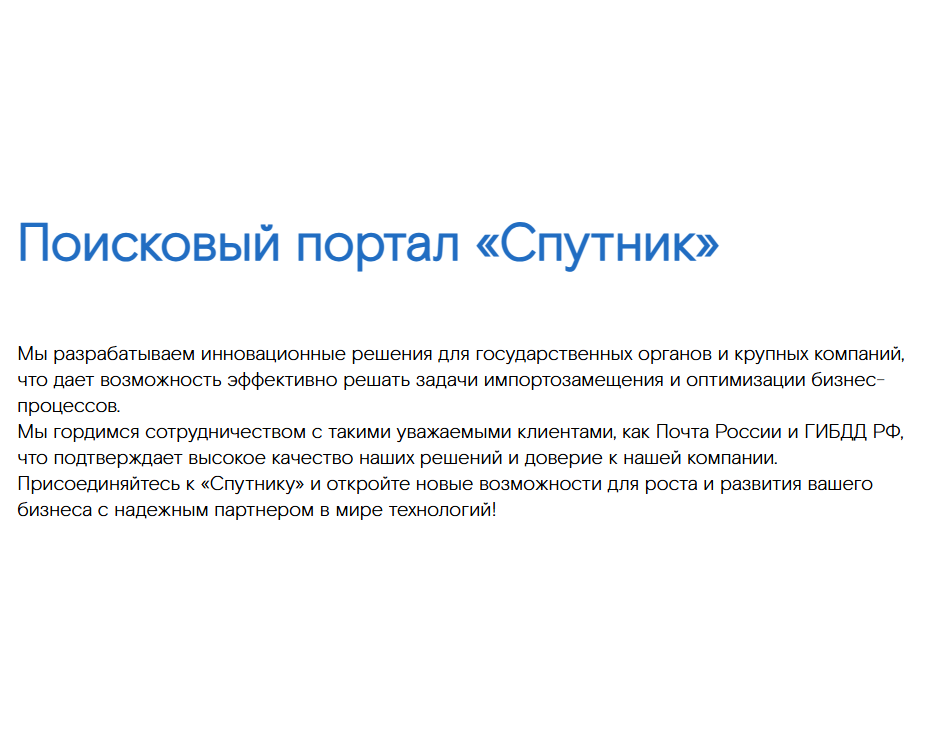

## TextBlockWithHeader - Текстовый блок с заголовком

Компонент, отображающий текстовый блок с заголовком. Позволяет указать тему оформления и содержимое текста в формате HTML.



### Входные данные

* `title` - заголовок блока
* `text` - содержимое текста, поддерживает HTML-разметку
* `theme` - тема оформления блока ('light' или 'dark')

### Пример использования

```
<template>
  <Page>
    <TextBlockWithHeader 
      title="Поисковый портал «Спутник»" 
      text="Мы разрабатываем инновационные решения для государственных органов и крупных компаний, что дает возможность эффективно решать задачи импортозамещения и оптимизации бизнес-процессов. <br /> Мы гордимся сотрудничеством с такими уважаемыми клиентами, как Почта России и ГИБДД РФ, что подтверждает высокое качество наших решений и доверие к нашей компании. <br /> Присоединяйтесь к «Спутнику» и откройте новые возможности для роста и развития вашего бизнеса с надежным партнером в мире технологий!" 
      theme="dark" 
    />
  </Page>
</template>

<script>
import { TextBlockWithHeader, Page } from 'sputnik-ui/src/index';

export default {
  components: { TextBlockWithHeader, Page }
}
</script>
```